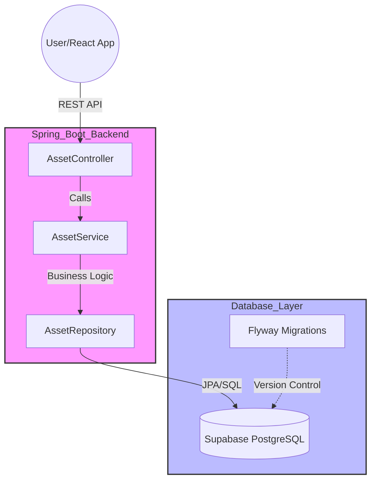

# InventoryPro - Asset Management

A Java backend built to demonstrate Java/Spring Boot architecture.

## System Architecture

## Tech Stack

- Language: Java 21

- Framework: Spring Boot 3.x

- Database: PostgreSQL (via Supabase)

- ORM: Spring Data JPA / Hibernate

- Migration: Flyway (Schema Versioning)

- Documentation: Swagger/OpenAPI UI

## Key Features

- Separation between Web, Service, and Data layers (Controller, Service, Repository) for better testability and scaling.

- Database Versioning: Utilized Flyway to manage schema changes.

- Search Functionality: Implemented partial name matching using JPA derived queries.

- Cloud Persistence: Fully integrated with a remote PostgreSQL instance for real-world data handling.

## Getting Started

1. Clone the repository: git clone https://github.com/pratyusha-ds/InventoryPro

2. Update src/main/resources/application.properties with your Supabase credentials.

3. Run ./mvnw spring-boot:run in the terminal.

4. Access the interactive Swagger UI at http://localhost:8080/swagger-ui/index.html.